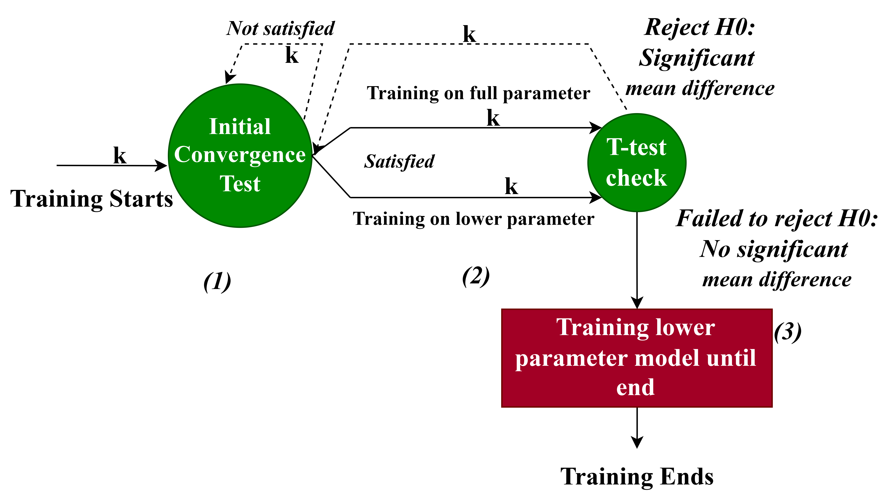

# HpT: Hybrid Acceleration of Spatio-Temporal Attention Model Training on Heterogeneous Manycore Architecture

HpT, a new hybrid approach to accelerate the training of attention-based models for scientific applications. Our approach is hybrid at two different
layers: at the software layer, our approach dynamically switches from a full-parameter training mode to a lower-parameter training mode by incorporating intrinsic dimensionality; and at the hardware layer, our approach harnesses the combined power of GPUs, resistive random-access memory (ReRAM)-based PIM devices, and systolic arrays. This software-hardware co-design approach is aimed at adaptively reducing both runtime and energy costs during the training phase, without compromising on quality. 

  <figure style="display:inline-block">

  
    <figcaption style="text-align:center;">Hybrid hardware layer architecture. This heterogeneous
manycore architecture accelerates the overall training process.</figcaption>

  </figure>

  <figure style="display:inline-block">
  
  <figcaption style="text-align:center;">Overall training flow</figcaption>
  </figure>

## Citation
Paper under review

Dahal, S., Dhingra, P., Thapa, KK., Pande, P. & Kalyanaraman, A. HpT: Hybrid Acceleration of Spatio-Temporal Attention Model Training on Heterogeneous Manycore Architecture (2024)

