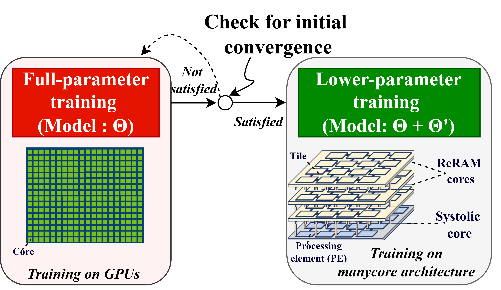

# HpT: Hybrid Acceleration of Spatio-Temporal Attention Model Training on Heterogeneous Manycore Architecture

HpT, a new hybrid approach to accelerate the training of attention-based models for scientific applications. Our approach is hybrid at two different
layers: at the software layer, our approach dynamically switches from a full-parameter training mode to a lower-parameter training mode by incorporating intrinsic dimensionality; and at the hardware layer, our approach harnesses the combined power of GPUs, resistive random-access memory (ReRAM)-based PIM devices, and systolic arrays. This software-hardware co-design approach is aimed at adaptively reducing both runtime and energy costs during the training phase, without compromising on quality. 

<p align="center">
  

   The fullparameter training mode starts on GPUs, and after satisfying the initial convergence and statistical tests, we obtain the pretrained model (Θ) and create a LoRA model (Θ′). Further,the training is done on lower-parameter training mode in heterogeneous manycore architecture, providing a fully-trained model.
</p>

## Paper
The associated preprint “HpT: Hybrid Acceleration of Spatio-Temporal Attention Model Training on Heterogeneous Manycore Architectures” is available [here](https://ieeexplore.ieee.org/abstract/document/10820024). 
## Citation

Dahal, S., Dhingra, P., Thapa, K. K., Pande, P. P., & Kalyanaraman, A. (2025) HpT: Hybrid Acceleration of Spatio-Temporal Attention Model Training on Heterogeneous Manycore Architectures. IEEE Transactions on Parallel and Distributed Systems.

##
## Dataset source
SWE model: https://github.com/Krishuthapa/SWE-Attention

COVID model: https://github.com/behnamnkp/Deep-MTS-LSTM

Wind model: https://github.com/amirstar/Deep-Forecast

The weather dataset is sourced from the WSU AWN and requires signing in to access. You can find it here: https://weather.wsu.edu/

## Installation Instructions
#### Requirements:
- Python 3.8
- Conda
- PEFT
- Python packages for Deep Learning

### Guide
All the main execution files for all four models are located in the model directory, while the data can be found in the data directory.
1. **Clone the HpT Repository:**

   ```bash
   git clone https://github.com/saimandahal/HpT
   
2. **Navigate to specific directory:**

   ```bash
   cd model/swe

3. **Run the main file:**

   ```bash
   python main.py
